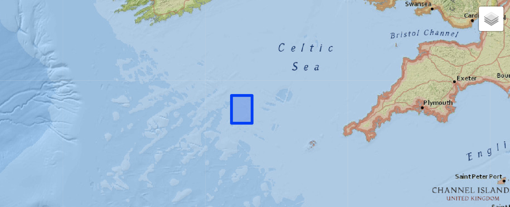

# AURORA, A multi sensor dataset for robotic ocean exploration

This repository accompanies the dataset and the report "AURORA, A multi sensor dataset for robotic ocean exploration", by Marco Bernardi, Brett Hosking, Chiara Petrioli, Brian J. Bett, Daniel Jones, Veerle Huvenne, Rachel Marlow, Maaten Furlong, Steve McPhail and Andrea Munafo.

> **Abstract** The current maturity of autonomous underwater vehicles (AUVs) has made their deployment practical and cost-effective, such that many scientific, industrial and military applications now include AUV operations. However, the logistical difficulties and high costs of operating at-sea are still critical limiting factors in further technology development, the benchmarking of new techniques and the reproducibility of research results. To overcome this problem, we present a freely available dataset suitable to test control, navigation, sensor processing algorithms and others tasks. This dataset combines AUV navigation data, side-scan sonar, multibeam echosounder data and seafloor camera image data, and associated sensor acquisition meta-data to provide a detailed characterisation of surveys carried out by the National Oceanography Centre (NOC) in the Greater Haig Fras Marine Conservazion Zone (MCZ) of the U.K in 2015.


<p align="center">

</p>


## Packages and dependencies

Necessary packages:

This notebook depends on the following packages:

- [scipy]() `pip install scipy` 
- [GDAL]() `pip install GDAL`   
- [OpenCV]() `pip install opencv-python`
- [Pillow]() `pip install Pillow`
- [pyxtf](https://github.com/oysstu/pyxtf) `pip3 install pyxtf`
- [ipyleaflet](https://ipyleaflet.readthedocs.io/en/latest/installation.html) `pip install ipyleaflet`

The notebook also forks the [pyall](https://github.com/pktrigg/pyall) package.

There is a conda equivalent for some of the packages and you might decide to use that:
- `conda install -c anaconda scipy`
- `conda install -c conda-forge gdal`
- `conda install -c conda-forge ipyleaflet`

You can also create an anaconda environment using the `req.txt` file provided in the `env` diredctory of this repository:

`conda env create --file env/req.txt`

or through the environment file `environment.yml` provided in the same folder:

`conda env create --file env/environment.yml`


To integrate it better with jupyter notebook run the following command:
```
python -m ipykernel install --user --name aurora --display-name="aurora"

```
You can now select the correct kernel directly from the Kernel menu.

If your jupyter_client in your environment is <5.3 then you might need to activate the ipyleaflet environment. You can do so, running:
```
jupyter nbextension enable --py --sys-prefix ipyleaflet
```


## Run it

Run the main notebook [aurora-dataset.ipynb](aurora-dataset.ipynb).
